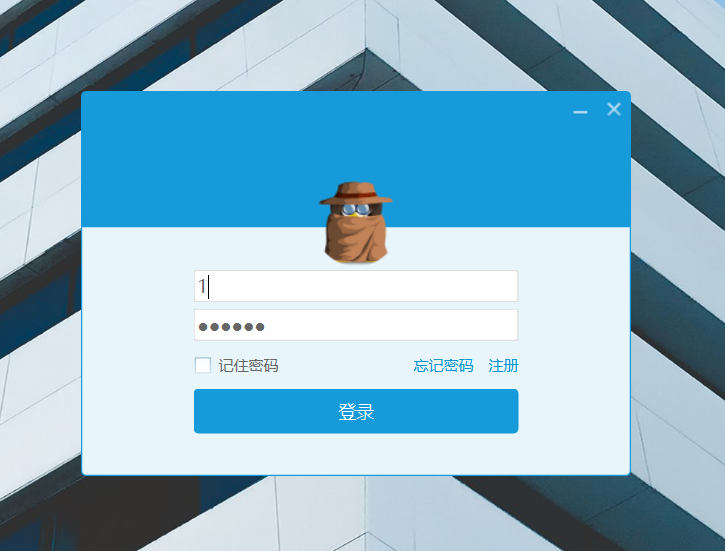
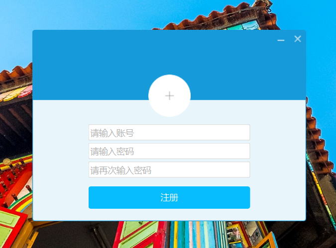
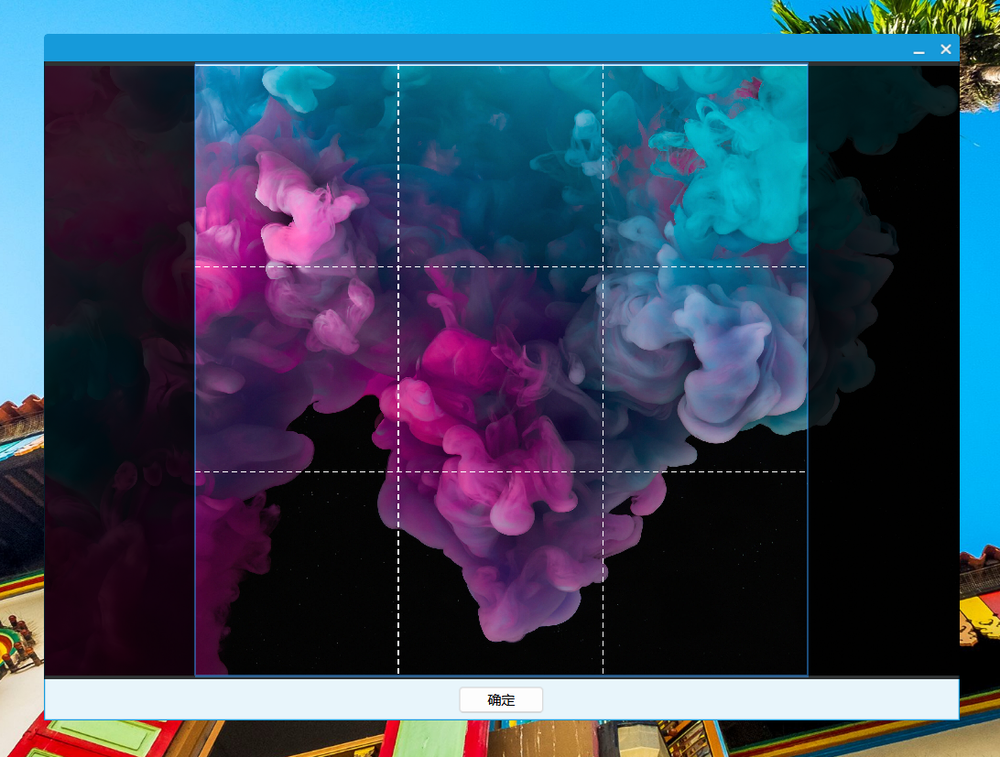
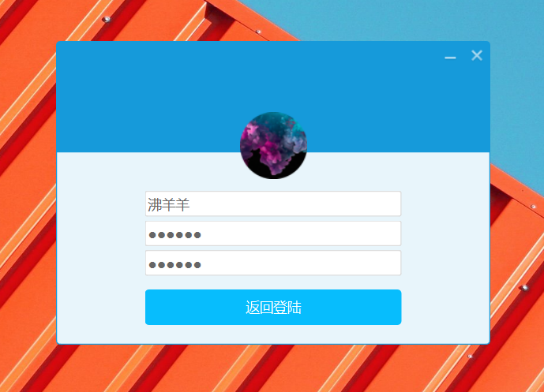
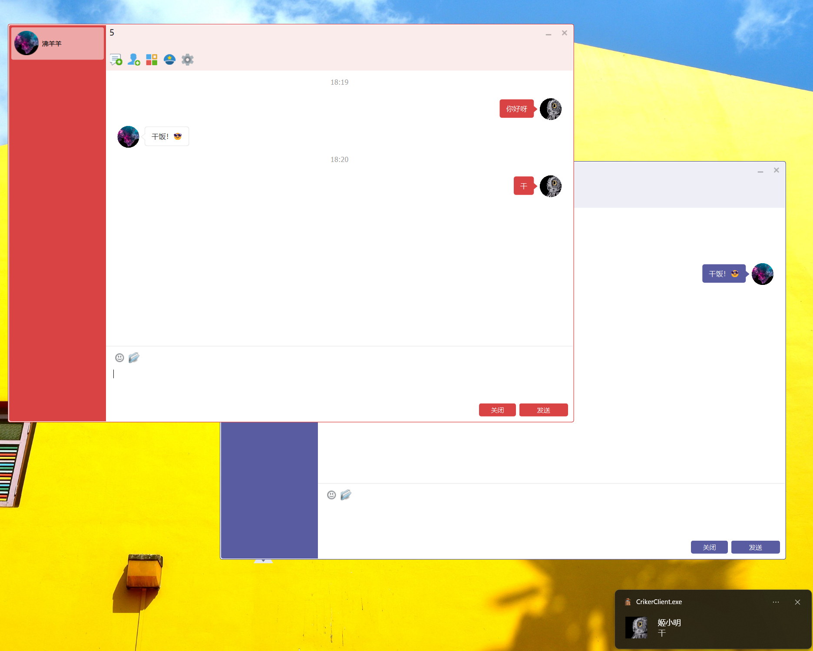
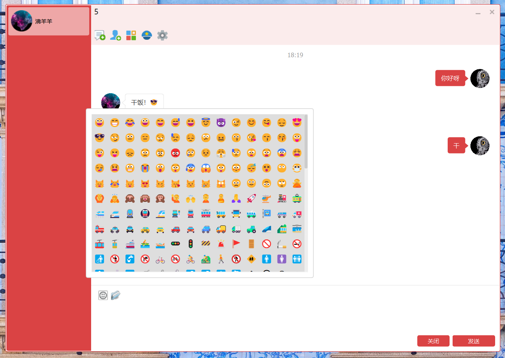
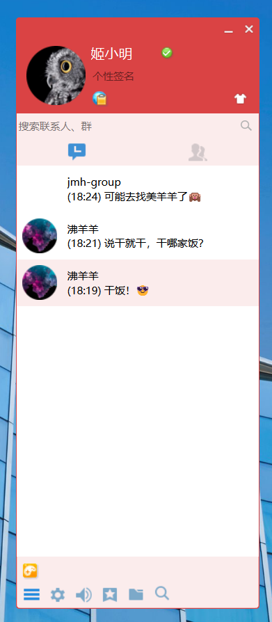

# Criker 即时通讯软件（客户端）

Criker 是一款简单开源即时通讯工具，旨在提供友好的用户界面，以满足您的聊天需求。无论是个人交流还是团队协作，Criker 都能提供良好的沟通体验。

本项目使用 Qt 6.5.2 框架编写，客户端包括服务端均采用 C++ 作为主要编程语言。作个人学习之用，使用了部分 C++20 特性，请确保您的编译器支持 C++20 标准。

## 特性

- **实时聊天**: 基于QListWidget实现了简洁美观的聊天气泡，支持随皮肤更换主题色。
- **头像编辑**: 支持注册界面头像的选择和拖动、裁剪等常用操作。
- **多平台支持**: 使用Qt 6.5.2 C++框架，极少量修改即可跨平台编译，包括 Windows、Mac 和 Linux。
- **群组聊天**: 创建群组，方便团队协作和项目讨论。
- **多媒体分享**: 支持Unicode Emoji表情的发送和接收。
- **安全加密**: 采用包头+包体的TLV格式通讯，包体内容为JSON。

## 编译

本项目在 Windows 平台下使用 Visual Studio 2022，同时配置 Qt VS Tool，配置完成之后可直接打开解决方案编译运行。若 Qt 版本不同，请更改 Qt Project Settings 的 Qt Version 选项，即可编译运行。

因个人精力有限，仅在Windows平台下测试，得益于Qt和C++的跨平台特性，Mac和Linux可转为CMake构建后编译运行，几乎无需修改源码。

## 快速开始

1. **登录/注册**: 启动应用程序后，您可以选择登录或注册新帐户。
2. **添加联系人**: 添加联系人功能的客户端界面尚未编写完成，等待后续代码更新，您可直接在MySQL中friend表写入测试，服务器接口已完成，本人会尽快完善。
3. **开始聊天**: 选择联系人并开始聊天，或群组进行群聊。

## 截图

## 技术细节

Criker 是使用以下技术构建的：

- **客户端**: 使用 Qt 6 框架构建用户界面。
- **服务端**: 使用 muduo 网络库、MySQL、Redis、NIGINX等构建服务器端应用。
- **数据存储**: 使用 MySQL 数据库存储用户和聊天数据。
- **实时通信**: 使用 TCP 长连接实现实时聊天功能，使用TLV格式自定义应用层通讯协议。

## 贡献

服务端 GitHub 仓库链接：[https://github.com/jmh000527/criker-server](https://github.com/jmh000527/criker-server)

## 联系我

如果您有任何疑问或反馈，可以通过以下方式联系我：

- 电子邮件：jmh000527@qq.com

谢谢您选择 Criker，愿您有愉快的聊天体验！
